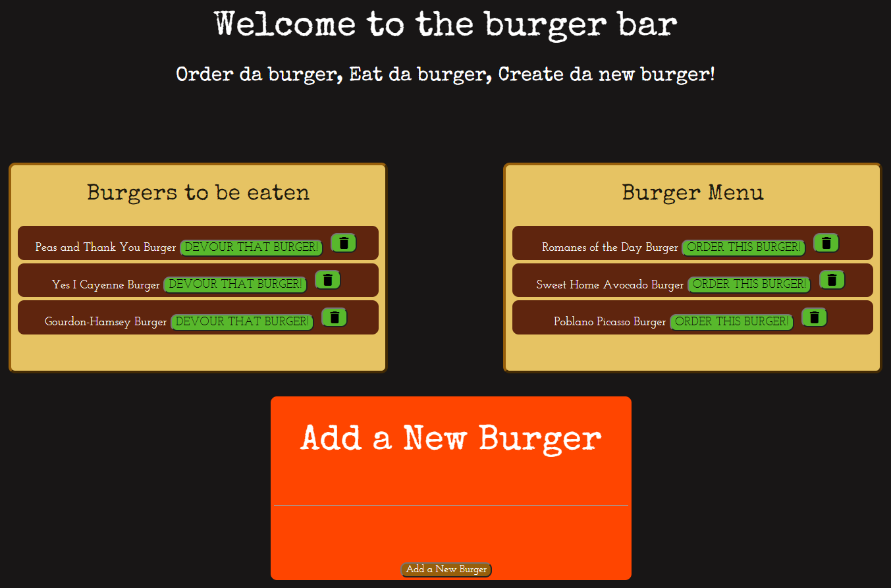
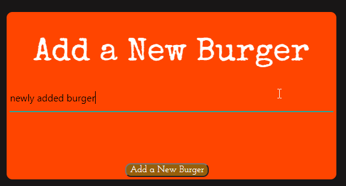
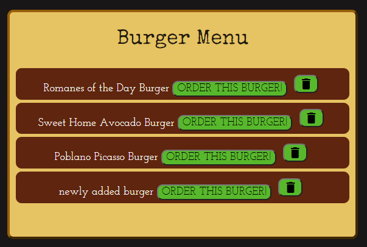
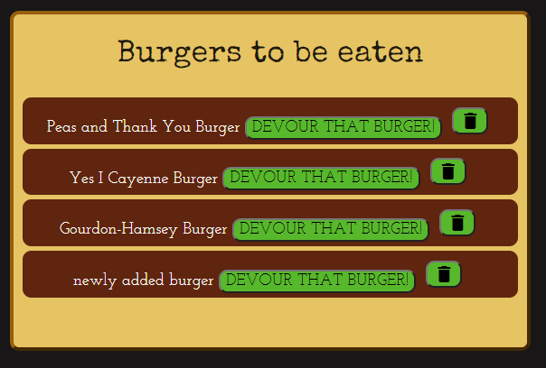
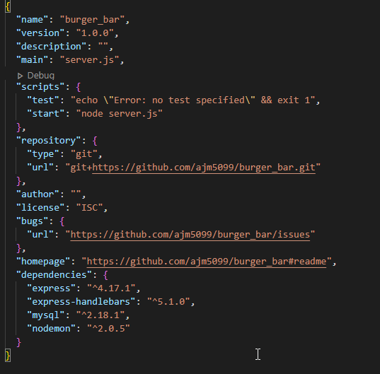
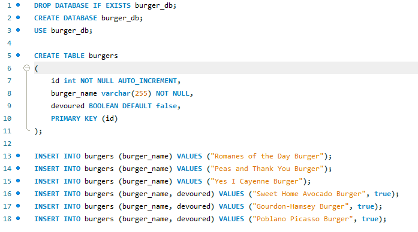

# burger_bar

## Authors: 
Alex Milroy  

## Table of contents:
* [Files](#Files)
* [Description](#Description)
* [Installation](#Installation)
* [Uses](#Uses)
* [License](#License)
* [Contributions](#Contributions)
* [Tests](#Tests)
* [Contact](#Contact)

## Files

## Description
The burger bar is a web application that shows off gourmet burgers you can order, and then devour the burgers when they are ready! Dont see a burger you like? You can add a new burger and have it made for you to be devoured! Burger bar uses a MYSQL database to store the burgers, and utilizes handlebars, node, express, and javascript to build the application.

Video of the application can be seen here: https://drive.google.com/file/d/1Lnk1b3ab13QqwMnMjz7aMJdxHAQXRQOK/view

## Installation
 Then users must install all required NPM packages (express, express-handlebars, mysql). Users must also create a new database in MYSQL. This application runs in a terminal window. To run this applications, users must first create a database in mysql by taking the seeds and schema files, and creating a new database. You can then run the application by opening a new terminal window, and typing “node tracker.js” to start the application. Then ope na new browser window, and navigate to "localhost:8080" to see the application.

## Uses
Once the application is running, the user can complete a few actions. They can see a list of burgers to be eaten on screen, and choose if they want to eat that burger, or delete that burger. Eating the burger moves it from the "to be eaten" menu, and places it back onto the "to be ordered" menu. Deleting the burger removes the burger from the restaurant completely, where it cant be eaten or ordered ever again. In the "to be ordered" menu, users can again delete a burger they dont like, or select a new burger to order, which will move it from the menu, to the "to be eaten" area. Finally, users can create new burgers by giving the burger a catchy name, and selecting if it should be made right away, or just placed on the menu.

## License
This application is goverened by the MIT license.

## Contributions
Yes

## Tests
Users can test the application be ensuring its reachable at localhost:8080 after the database has been created, and a node server is running. Users can also test functions of the database by 1: eating or making a burger to test that objects can have attributes about them changed. 2: deleting a burger to ensure delete works. 3: creating a new burger to ensure create works.
    
## Contact:
github.com/ajm5099
amilroy@gmail.com

